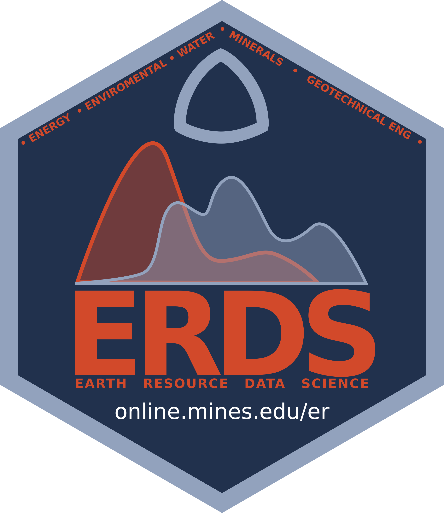

 

# "Earth Resource Data Science" graduate certificate at Colorado School of Mines.

The Earth Resource Data Science graduate certificate at Colorado School of Mines consists of four courses (12 credit hours) that can also be included as coursework towards an M.S. or Ph.D. degree at Mines.

This fully online program introduces the fundamentals of python data science as it pertains to characterization, extraction, and sustainable development of surface and subsurface Earth resources. This program will enable students to organize, analyze, and visualize earth-resource data as well as automate repetitive tasks, making them more efficient and innovative scientists. The program covers fundamental data science (no pre-requisities necessary!) and advanced topics like machine-learning and web-scraping. Fourteen elective choices offer flexibility, allowing students to customize the certificate towards their industry.

## Why you may want to enroll
Digitalization has profoundly affected all facets of geoscience, including extractive industries (e..g, oil and gas, minerals, water resources), remote sensing of Earth change, environmental monitoring & remediation, and geological engineering. More data is available for detailed analysis to improve decision making and influence policy at all levels. Changing commodity prices have added to the need to improve the efficiency of operations in order to drive more effective and responsible development of Earth resources and to provide attractive investment returns for shareholders.

Data science is a vitally important skill, particularly when paired with deep domain knowledge pertaining to Earth resource characterization, extraction, and sustainable development.

## Courses
### Mandatory courses (in this order):
1. DSCI 403 	Introduction to Data Science
1. GEOL 557 	Earth Resource Data Science I – Fundamentals
1. GEOL 558 	Earth Resource Data Science II – Applications and Machine-Learning
1. Elective (see choices in the courses repo

## Want to apply?
[Click here to apply on the Mines website](https://online.mines.edu/earth-resources-online/)
Need a waiver for the application fee? Email zanejobe at mines dot edu to ask. 

## FAQ
- Are all the courses online, or are there in-person options?
  - All courses are online and 'asynchronous', meaning there is no official time that the class meets. In other words, there are no live lecture periods - all the work is done at your own pace. However, there are structured times for students to be able to interact with faculty “live” via office hours and other means (e.g., Slack, Zoom).
- How much time does each class take?
  - Each course is 8 weeks long, with a time commitment of about 15 hours per week
- Can I work at my job while completing the certificate?
   - Absoluately! That is the idea behind asynchronous learning - you learn at your own pace, when you have time. If you can spare 15 hours a week for 8 weeks at a time (e.g., by not Netflixing :wink:), then you can complete the certificate!  
- How much time will this certificate take?
   - Ideally, one year (see below). However, the elective option may not be offered in the semester that you require. However, you may be able to take the elective concurrently with another course, if approved by the professor(s) teaching the courses.
- Can I complete the certificate in two semesters?
   - Ideally, you can complete the certificate in one year, with the following schedule:
      - Fall 1st online session (August - October) **DSCI 403**
      - Fall 2nd online session (October - December) **GEOL 557**
      - Spring 1st online session (January - March) **GEOL 558**
      - Spring 2nd online session (March - May) **Elective** (if offered)
